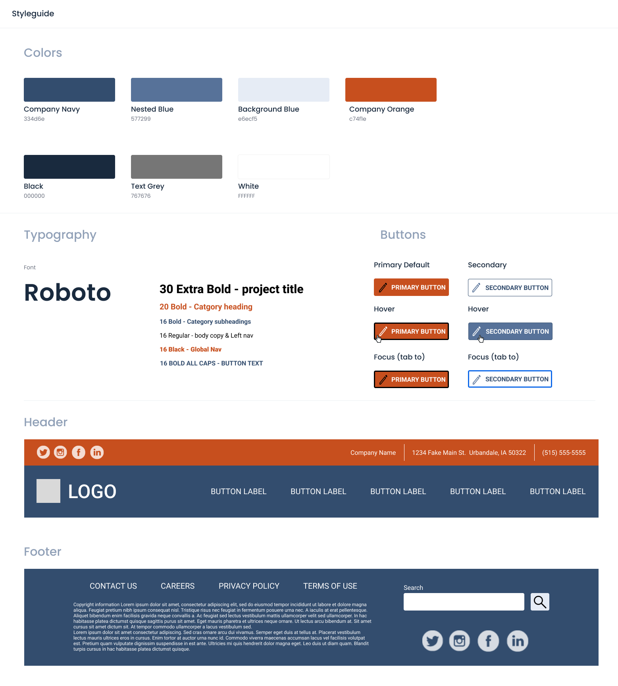

One of the main advantages of choosing a micro-service architecture for the services that back a company's web application is to allow multiple teams to independently own components of the system. 
These components can choose different tech stacks, architecture choices, and deploy features and updates on different schedules.

When it comes to the frontend however, these same organizations will often deploy a single Javascript code base to be the UI for a large part of the company's functionality.
In doing this, the cadence of feature releases, bug fixes, updates, and software choices are tightly coupled between teams.
Breaking up the frontend brings with it additional challenges.
Each logical area must appear to the end users as a cohesive experiance. It must be consistent in styling, coloring and functionality. 
Additionally, there are usually components that must span across areas of the site, such as a common header or footer.

One of the most common attempts to solve these problems involves the creation of a shared UI library that all teams can import into their respective applications.
This library is generally written using a UI framework that the company has settled on such as React or Vue.
The shared library strategy introduces two new issues however.
Firstly, using the library generally requires that all the applications use the same UI framework, and that they are within a narrow band of versions of that framework.
If a team wants to update to a new major version of React, this can break compatability with the library so either they have to wait and update the entire organization at once, or multiple versions of the library must be maintained.
Secondly, because these libraries are included at build time into each application's bundle, they are only changed when a build happens.
If a change is desired that spans across all applications, such as changing a social icon from an animal to a letter, a new version has to be released and deployed in all applications.
These deploys will most likely not take place concurrently, so users will see an inconsistant view of these components as they navigate between pages.

The above downsides can of course be avoided by throwing money, discipline, and planning at the problem.
This post lays out an alternate strategy to provide a common style across multiple disconnected applications without forcing technical or planning decisions of the individual teams.

### The Style Guide

I spoke to [Jenn M], one of our UI/UX experts here at Source Allies, and asked her to come up with a simple example style guide for a fictional company.
She quickly responded with the following, which is very similiar to what we often see various UI designers produce for development teams:



In order to support our common styles, we will start by spinning up a new NPM project that we will statically serve and use to host the common assets shared between applications.
Unlike an NPM library, every refresh of a users browser will pull the latest copy of shared assets.
And, since all of the applications will use the same URL for those assets, the browser cache will stay consistant.

### Common Company Colors

Every brand has a color palette that defines the specific colors that should be used for various parts of site.
They rarely change, but if a developer is off by even a couple points then users will notice something is "off" as they navigate around.
The simplest way to share these across applications is to simply create a CSS file `styles.css` and include a set of [CSS custom variable declarations](https://developer.mozilla.org/en-US/docs/Web/CSS/Using_CSS_custom_properties) for these colors:

```css
:root {
    --company-navy: #334d6e;
    --nested-blue: #577299;
    --background-blue: #e6ecf5;
    --company-orange: #c74f1e;
    --black: #000000;
    --text-grey: #767676;
    --white: #FFFFFF;
}
```

Every application can now color anything needed by including this style sheet and writing a rule such as `color: var(--black);`.
We are creating an API contract here.
Rather than it being defined using JSON structures and HTTP path patterns, we are defininig it by URLs and exposed variable names.

### Typography

Fonts, sizing, and common styling can be implemented the same way.
We add font declarations to our `style.css` file by adding:

```CSS
@import url('https://fonts.googleapis.com/css2?family=Roboto:ital,wght@0,100;0,300;0,400;0,500;0,700;0,900;1,100;1,300;1,400;1,500;1,700;1,900&display=swap');

:root {
    font-family: 'Roboto', sans-serif;
    font-size: 16pt;
    padding: 0;
    margin: 0;
}
h1 {
    font-size: 30pt;
}
h2 {
    font-size: 20pt;
}
h3 {
    font-size: 16pt;
    font-weight: bold;
}
nav {
    font-weight: bold;
    font-size: 1rem;
}
```

In this example we are setting the default font-family for the entire page.
We are also adding another API to our contract, we are defining the font styling for the `h1`, `h2`, `h3`, and `nav` elements. 
Be careful here;
While it is tempting to define styling for a large number of elements, we do not know the context that those elments are used in. 
One of the big killers of internal UI libraries is making a lot of assumptions about how components will be used and then having an explosion of complexity as countless flags and parameters have to be added to handle the scenerios.
Instead, focus on a few elements that are very consistantly used.

### Buttons and Other Native Components

Instead of styling the plain `button` element, we are forcing the applications to opt-in to the button styling by defining classes (`sai-primary-button` and `sai-secondary-button`).
This way, if an application adds a button element for semantic reasons or needs to style it another way they do not have to "undo" all of the common styling. 

```CSS
.sai-primary-button, .sai-secondary-button {
    text-transform: uppercase;
    font-weight: bold;
    border-radius: 5px;
    border-style: solid;
    padding: .5rem;
}
.sai-primary-button {
    border-color: var(--company-orange);
    background-color: var(--company-orange);
    color: var(--white);
}
.sai-primary-button:hover {
    border-color: var(--black);
    cursor: pointer;
}
.sai-primary-button:focus {
    border-color: var(--black);
}

.sai-secondary-button {
    border-color: var(--nested-blue);
    background-color: var(--white);
    color: var(--nested-blue);
}
.sai-secondary-button:hover {
    border-color: var(--company-navy);
    background-color: var(--nested-blue);
    color: var(--white);
    cursor: pointer;
}
.sai-secondary-button:focus {
    border-color: var(--nested-blue);
}
```

### Common Header and Footer

So far, we have been able to support a common style guide across applications while only relying on native web technologies (CSS).
We have not forced the applications to do anything other than include a stylesheet and use classes and variable references on things as appropriate.
Some parts of our site require not only a consistent style, but also consistent behavior.
We need Javascript to support these components.

[Web Components](https://developer.mozilla.org/en-US/docs/Web/API/Web_components) are a collection of web standards that allow us to define custom elements and then include them within a hosting page.
We can leverage this technology to create a `sai-header` or `sai-footer` custom element.
The individual applications can then put this at the top and bottom of each page regardless of what UI framework they are utilizing.
Additionally, custom web components use a [shadow dom](https://developer.mozilla.org/en-US/docs/Web/API/Web_components/Using_shadow_DOM) to ensure that the styling of the hosting page does not bleed over into the component styling.

The downside is that web components are somewhat complicated to create and don't lend themselves well to a reactive programming model.
To aid in this we can leverage a newer library called [Lit](https://lit.dev). 
This is a very small library that allows us to define a component along with a lifecycle for updating that component as things change (such as users clicking on menus or getting signed in).

Refer to the [Lit Documentation](https://lit.dev/docs/) for a complete reference. 
For our custom header we create a `header.ts` file with the following:

```typescript
import { LitElement, html, css } from "lit";
import { customElement, property, state } from "lit/decorators.js";
import logoImage from './source-allies-logo-final.png';

@customElement("sai-header")
export class Header extends LitElement {
    static styles = css`
        @import url("/styles.css");   
        :host {
            width: 100vw;
            display: block;
            position: sticky;
            z-index: 1000;
        }
        HEADER {
            display: flex;
            flex-direction: row;
            justify-content: space-between;
            background-color: var(--company-orange);
            color: var(--white);
            padding: .5rem;
        }
        /* additional styling */
    `;

    render() {
        const imgUrl = new URL(logoImage, import.meta.url).href;
        return html`
            <header>
                <!-- header content here -->
            </header>
            <nav>
                <!-- second level nav content -->
            </nav>
        `;
    }
}
```

Refer to our [Github Repository](https://github.com/sourceallies/micro-frontend-blog) for the complete file.
This file exports a single custom web component.
Notice how we are importing our `styles.css` file at the top and then leveraging the color variables to ensure we align with the company colors.
Images, and other assets can be referenced relative to this component and included as well.

The usage for the individual applications is similar to the styling. 
Each application includes a reference to where our style guide is deployed:
```html
<script type="module" src="https://example.com/style-guide/header/header.ts"></script>
```

They then just include the common header like any other element:
```HTML
<body>
    <sai-header></sai-header>
    <main>
        <h1>Page Tilte</h1>
        ...
    </main>
    <sai-footer></sai-footer>
</body>
```

Unlike `iframe` elements or server side includes, passing information to and from these custom components is easy. 
Attributes can be added to the element and the custom component will receive these.
The custom component can raise events and these can be received by the host page by registering event handlers on the element.

### Conclusion

Technical teams can now develop their applications using the technology of their choice, on the release cadence that works for them.
The UI team can own and provide the standards needed to ensure a consistent brand.
This is a simple, but powerful strategy to share common UI components and functionality between teams and applications without incurring a massive cost of maintenance or introducing large amounts of technical debt, with the only constraint based around native web standards that all modern browsers support.
